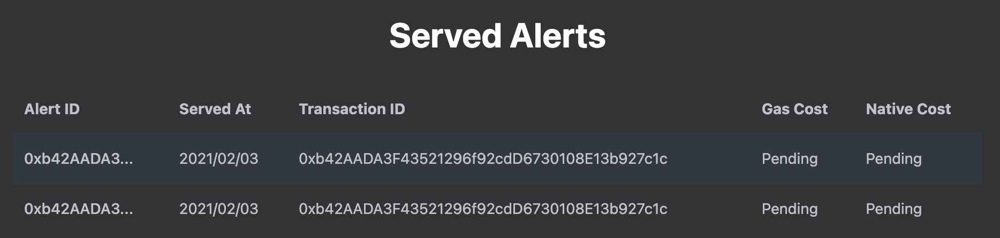

# Monitor Your Alerts

When your contracts are registered and have started triggering alerst, you would like to stay on top of their status. You would like to check their balances and check the alerts that have been triggered and how much it has costed you to trigger each alert. 

The Served Alerts table purpose of to allow you to track your contracts' served alert and stay on top of costs and activate.

Previous! [<](./register)