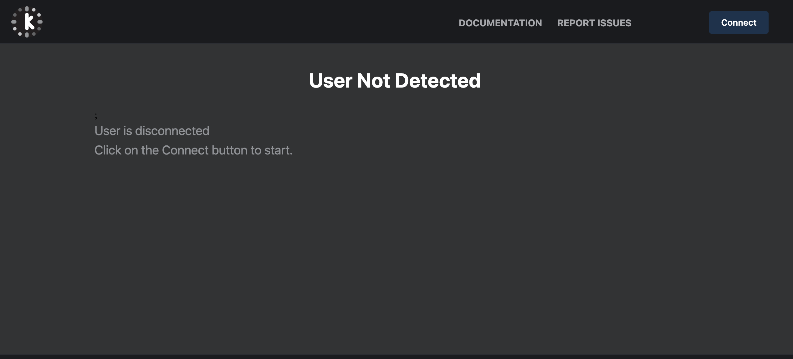
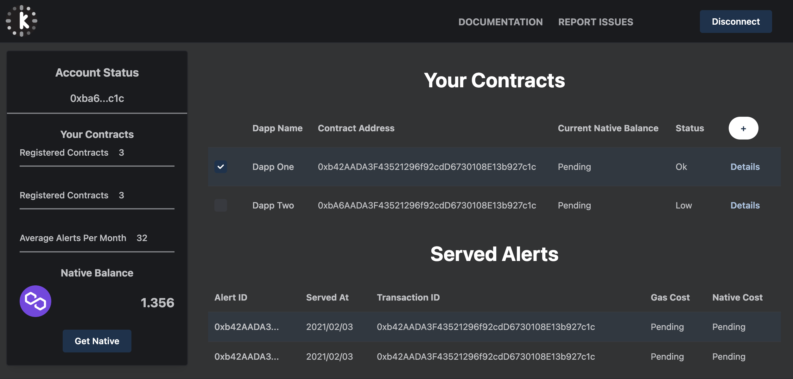
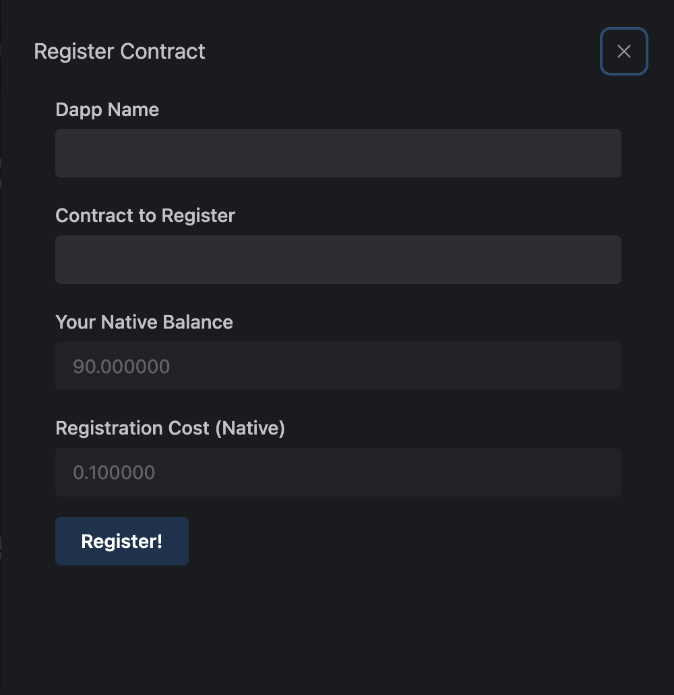

# Register Your Client Contract
## The Khronus Dapp

The [Khronus Dapp](dapp.khronus.xyz) requires:

- An Ethereum provider in your browser.
- Connection to the Polygon Mumbai testnet.

### Ethereum Provider and Network Connectivity

- Any Ethereum wallet installed in your browser, as an extension or embedded, will come with an Ethereum Provider ready to connect to RPC Nodes. The Dapp will let you know if no Ethereum Provider is detected.
- Khronus Dapp is only available in Polygon Mumbai testnet. If mumbai is not the selected network the Dapp will not be active. For instructions on adding Polygon Mumbai testnet to your Metamask click [here.](https://docs.polygon.technology/docs/develop/metamask/config-polygon-on-metamask/){:target="_blank"}

- If everything is correct you will see the Dapp Connect button as active.

### Registering Your Contracts

After connecting you will see the dapp with the following sections.

- Your Account
- Your Contracts
- Your Alerts

In the your contracts sections you can see a + sign button, clicking on this button will open the contract registration dialogue.

In this Dialogue you can define a name for your Dapp, this is a nickname, it only exist in Khronus Frontend for your convenience. Also, and more importantly, you define the the contract address. Your contrack should have been deployed following the instructions [here.](./drafting-deploying){:target="_blank"} 

Upon clicking Register! your account will transfer the registration deposit, in Mumbai Testnet tokens, to the Khronus Coordinator contract. Your alerts are paid from the balance of your client contract in the coordinator. If the contract has no funds your alerts will not go through. This because gas and a markup to the node operators paid for each alert served.

If your contract balance in the protocol is close to be depleted, you can click in the Details button next to each of the contract to fund the specific contract with more Mumbai Testnet Tokens.

